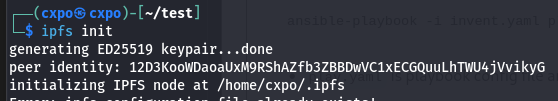
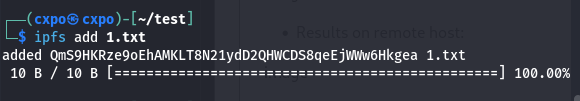
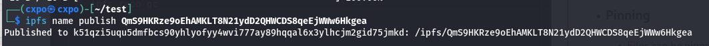

# DevOps is uploaded at Gitlab
### Link : https://gitlab.com/spider8200133/onsite-devops 

# IPFS (InterPlanetary File System)

## IPFS Node Setup
- To initialise node:



- To bring node online:

```bash
ipfs daemon
```
## File Upload and Retrieval
- Files can be added to IPFS by
```bash
ipfs add <filename>
```
- Example:



- Uploaded file can be retrieved by CID 

```bash
ipfs get <CID>
```

## Features
- ### Pinning
    - Files can be pinned by
    ```bash
    ipfs pin add <cid>
    ```
    - If you wish to prevent the files from being garbage collected, you need to pin them. 
- ### Mutable links
    - You create an IPNS name linked to your IPFS node's ID by:

    
    
- ### Garbage Collection
    - To delete all files except pinned files:
    ```bash
    ipfs repo gc
    ```


## Application for File Upload and Retrieval
- I created application using `Flask` and `IPFS` API for uploding and retrieving file.
- I also dockerised the app with `ipfs/go-ipfs` iamge and hosted it on AWS E2C.
- I don't have domain names. So I used `DuckDNS` for DNS services and `Lets Encrypt` for SSL Certificates.

### Link : https://spider-onsite-ipfs.cxpo.duckdns.org

## File access through Public IPFS Gateway
- Once file is uploaded, CID is generated.
- You can view file through public link provided or through the server node itself.

>__Note__ : Public URL takes some time (nearly 30 minutes) to index file since upload.
